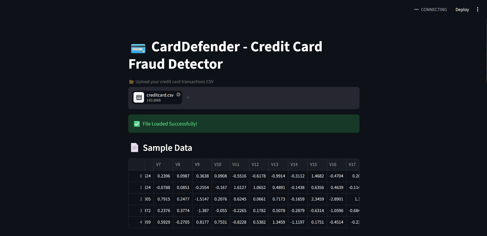
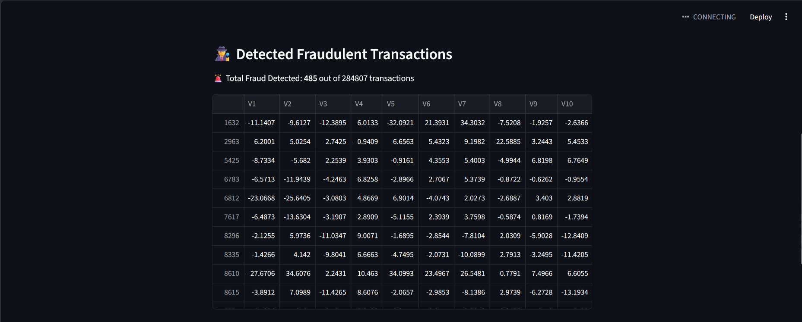
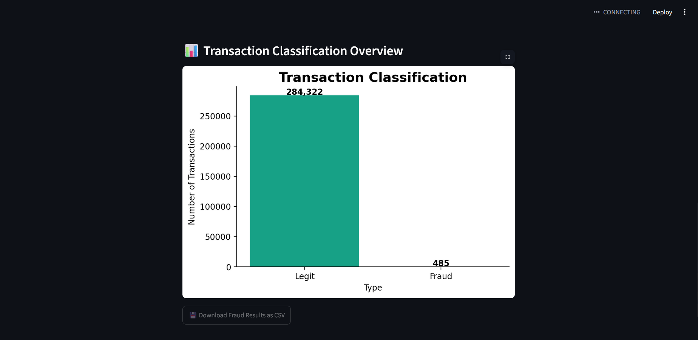

# 🛡️ CardDefender

AI-powered Credit Card Fraud Detection System built using Machine Learning and Streamlit.

## Features

- Fraud transaction detection
- Interactive Streamlit dashboard
- Data visualization
- Suspicious transaction analysis
- CSV export support

---

## Tech Stack

- Python
- Pandas
- NumPy
- Scikit-Learn
- Streamlit
- Matplotlib
- Seaborn

---

## Installation

```bash
git clone https://github.com/yourusername/CardDefender.git

cd CardDefender

pip install -r requirements.txt
```

---

## Run Application

```bash
streamlit run src/app.py
```

---

## Project Structure

```text
CardDefender/
│
├── dataset/
├── src/
│   ├── app.py
│   └── main.py
├── requirements.txt
├── README.md
└── .gitignore
```

---

## Screenshots

### Dashboard



### Fraud Analysis

### Detection Results


---

## Contributing

Contributions are welcome.

1. Fork repository
2. Create feature branch
3. Commit changes
4. Push branch
5. Open Pull Request

---

